# careerkit  
### *An open, extensible system for running a thoughtful job search as an engineering leader*

---

# 📘 Table of Contents

- [Vision & Purpose](#-vision--purpose)  
- [Who This Is For / Not For](#-who-this-is-for--not-for)  
- [Philosophy](#-philosophy)  
- [Daily / Session Loop](#-daily--session-loop)  
  - [Quick Reference](#-quick-reference)  
  - [Fast Fit Filter](#-fast-fit-filter)  
  - [Recommended Tracking Columns](#-recommended-tracking-columns)  
  - [Default Session Flow](#-default-session-flow)  
- [Weekly Steering](#-weekly-steering)  
  - [Big Picture Strategy Flow](#-big-picture-strategy-flow)  
  - [Weekly Review System](#-weekly-review-system)  
  - [Signals](#-signals)  
- [Deep Dives](#-deep-dives)  
  - [Role Discovery](#-role-discovery)  
  - [Triage](#-triage)  
  - [Vetting](#-vetting)  
  - [Application Preparation](#-application-preparation)  
  - [Apply & Update](#-apply--update)  
  - [Networking](#-networking)  
  - [Interviewing](#-interviewing)  
- [Resources & Automation](#-resources--automation)  
  - [Environment Setup](#-environment-setup)  
  - [Automation Ideas](#-automation-ideas)  
  - [Interview Question Rubrics](#-interview-question-rubrics-engineering-leadership)  
  - [STAR Answer Examples](#-star-answer-examples-engineering-leadership)  
  - [What To Do When You’re Stuck](#-what-to-do-when-youre-stuck)  
  - [Queuing & Batching Tasks](#-queuing--batching-tasks-avoid-cognitive-thrash)  
- [Career Kit Roadmap](#-career-kit-roadmap)  
- [Contributing](#-contributing)  

---

## 🌅 Vision & Purpose  

After speaking with engineering leaders, former managers, and close friends whose careers I deeply respect, I realized everyone had their **own private, bespoke job-search system** — notes, spreadsheets, rituals, scripts, bookmarks, browser tabs, scattered documents.

These systems worked… but none were shared. None were reusable. None embodied the openness we expect in engineering.

As engineers, we value **FOSS principles**, clarity, documentation, and continuous improvement.  
So why not bring those same principles to our careers?

**careerkit** is my attempt to create an **open, forkable, community-improvable job-search playbook** for engineering roles (SRE, Platform, Infra, DevOps, AI Infra) that is both useful for myself and valuable to others who I mentor.

This guide captures:

- What consistently works in a real job search  
- How to stay focused and avoid thrash  
- How to evaluate opportunities with clarity  
- How to message recruiters intelligently  
- How to build a sustainable, values-aligned pipeline  
- How to improve through feedback and iteration  

If this helps you:  
➡️ **Fork it**  
➡️ **Document your own process**  
➡️ **Submit PRs** to improve wording, add templates, or propose automation  

Let’s build a shared ecosystem for navigating engineering careers with intention.

---

# 👥 Who This Is For / Not For

**For**  
- Initially and primarily, this is a kit of tools for myself
- Additionally, my hope is that it is also helpful for other engineers targeting SRE, Platform, Infra, DevOps, AI Infra or other similar roles 

**Not for**  
- Non-engineering job searches
- People looking to use high-volume spray-and-pray approaches  
- Anyone looking for generic recruiter templates without customization

---

# 🧭 Philosophy

A great job search for engineering leaders is:

- **Intentional**, not high-volume  
- **Signal-driven**, not noisy  
- **Ethical**, not opportunistic  
- **Relationship-oriented**, not transactional  
- **Iterative**, with structured retrospectives  
- **Documented**, not reinvented each time  

---

# 🗓️ Daily / Session Loop
*A 60–120 minute workflow you can run on repeat.*

1. Choose a comfortable location to work from (home office, library, coffee shop).  
2. Open your laptop & close distractions.  
3. Open:
  - Your focus playlist (e.g. [**Spotify "House Focus"**](https://open.spotify.com/playlist/37i9dQZF1DX8wtrGDH81Oa))
  - Your tracker sheet or Simplify/TealHQ  
  - ChatGPT, NotebookLM, or your AI coach of choice, ideally with a project or agent that has a tailored system prompt  
  - Resume templates & company notes Drive folders
4. Review what's in your "Applied" column and update information, follow up if you haven't been in contact for over a week
5. Look at your "Saved" column (e.g. in Google Sheets, [Teal](https://app.tealhq.com/job-tracker), or [Simplified](https://simplify.jobs/tracker)) to see if you want to remove or reorder it
6. Search for two new prospects and assign an out of 5 excitement score (see below for more details on fit)
7. Apply to two jobs & create or update a company notes doc for each
8. Add any follow-up items to your TODO Tracker (e.g. [Trello](https://trello.com) or [Linear](https://linear.app)
9. Update this document if you made any changes to your process

## ⚡ Reference

### Where to Search
- LinkedIn (Recommended, Alerts)  
- Welcome to the Jungle — https://www.welcometothejungle.com
- Wellfound — https://wellfound.com  
- Hiring.cafe — https://hiring.cafe
- [Teal](https://app.tealhq.com/job-search) or [Simplify](https://simplify.jobs/) if you use those tools. 
# TODO: Jobspy Notebook?

---

## Fast Fit Filter  
A role should pass the majority of these criteria:

- JD is detailed, realistic, and recent  
- Has the right title (e.g. Engineering leadership - SRE, Platform, Infra, DevOps, AI Infra, etc)  
- Is in the right place (e.g. Remote US or hybrid in target cities)  
- Has the right compensation (e.g. ≥ $180k + equity or a number that makes sense to you)  
- Is ethically aligned (e.g. no weapons, gambling, destructive industries)
- You feel legal won't disqualify you (e.g. Doesn't require security clearance and there are no visa sponsorship issues)

---

## Recommended Tracking Columns

| Column | Purpose |
|--------|---------|
| Company | Name |
| Discovered | Where you found the role |
| Posted | Posting age |
| Applied | Date applied |
| Status | Lead / Qualified / Applied / Interviewing / Closed |
| Source | LI, WTTJ, Wellfound, etc |
| Interest | 1–10 |
| Connection | Warm / 2nd-degree / none |
| Position(s) | Title(s) |
| Position Opened | Posting date |
| Pay | Salary range |
| Crunchbase | Stage + funding |
| Location | HQ / remote |
| Tech Blog | Engineering blog |
| Hiring Manager | If known |
| Company Size | Headcount |
| Team Size | Size of relevant team |
| Glassdoor | Notes |
| LinkedIn | Company page |
| Twitter | Optional |
| Info / Mission / Tech | Summary |
| Pros | Why apply |
| Cons | Risks |
| Timeline | Interviews + notes |

---

## 🔄 Default Session Flow  
*Hands-on loop for a single session.*

```mermaid
flowchart LR
    A["Start session<br/>Choose workspace & set up"] --> B["Open tools<br/>Tracker, LLM, Docs"]
    B --> C["Set goals<br/>Triage 5 roles, apply to 1–2"]
    C --> D["Discover roles<br/>LinkedIn, WTTJ, Wellfound, Hiring.cafe"]
    D --> E{"Pass Fast Fit Filter?"}
    E -->|No| D
    E -->|Yes| F["Add to Tracker as Lead"]
    F --> G{"Done triaging?"}
    G -->|No| D
    G -->|Yes| H["Vetting<br/>Glassdoor, Crunchbase, blog"]
    H --> I["Assign Fit Score (0–10)"]
    I --> J{"Score ≥ 7?"}
    J -->|Yes| K["Qualified"]
    J -->|No| L["Deprioritize"]
    K --> M["Pick 1–2 to apply"]
    M --> N["Tailor resume<br/>Summary + bullets"]
    N --> O["Optional cover letter"]
    O --> P["Apply"]
    P --> Q["Update Tracker<br/>Applied + follow-up +7d"]
    Q --> R["Check LinkedIn connections"]
    R --> S["Wrap up<br/>Insights + next actions"]
```

---

# 🧠 Weekly Steering  
*Weekly review + adjustments.*

## Big Picture Strategy Flow  
*Decide where to focus next.*

---

## 🔁 Weekly Review System  

Evaluate:

- Pipeline health (Leads → Qualified → Applied → Interviewing)  
- Stage-by-stage conversion  
- Morale & energy  
- Patterns in rejection or recruiter feedback  
- Choose next week’s emphasis:
  - Lead generation  
  - Upskilling  
  - Brand polish  
  - Networking  

---

## 🧩 Signals  

### Time to Upskill if:
- Rejected during early technical screens  
- System design answers feel weak  
- Difficulty articulating reliability tradeoffs  

### Time to Generate Leads if:
- Few Qualified roles  
- Low excitement pipeline  
- Many roles scoring <7  

### Time for Brand Work if:
- Recruiter responses stall  
- Applications don’t progress  
- Resume/LinkedIn lack clear narrative  

---

# 🔎 Deep Dives

## Role Discovery  
Use:

- LinkedIn Recommended + Alerts  
- Welcome to the Jungle  
- Wellfound  
- Hiring.cafe  
- JobSpy scripts  

**Note:**  
Long-term, this workflow can evolve into a JobSpy-powered ingestion pipeline that centralizes all discovered roles into a single CSV/Sheet for triage.

---

## Triage  
Lean on the Fast Fit Filter:

- Leadership expectations are clearly defined  
- Compensation and location align  
- Ethical filter passes  
- JD is recent, detailed, and realistic  

Else → skip quickly.

---

## Vetting  
Evaluate:

- Glassdoor (rating & recent engineering reviews)  
- Crunchbase (funding + runway)  
- Engineering blog and technical brand  
- Mission alignment  
- Role clarity  

Assign a **Fit Score (0–10)**.

---

## Application Preparation

### Resume  
- Copy the nearest resume template.  
- Tailor the summary (+ bullets) using ChatGPT.  
- Adjust 2–3 bullets honestly to align with the JD.  

**Prompt for generating the resume summary blurb:**  
> "Draft a resume summary blurb for this role. No emdash. Concise. This will go at the top of my resume. Emphasize engineering leadership, reliability, platform thinking, and measurable impact."

Optional extension:  
> "Use language aligned with the JD below:"  
> *(paste JD here)*

### Cover Letter  
Use only for high-fit, mission-driven roles.

---

## Apply & Update  
Immediately after applying:

- Update all tracking fields  
- Add follow-up reminder (+7 days)  
- Link JD + resume + company notes  
- Note warm connections (or lack thereof)  

---

## Networking  

- Look for warm or second-degree connections  
- Reach out *after* applying  
- Attend ≥2 meetups per month  
- Monthly reconnect with an advocate or collaborator  

---

## Interviewing  

### Before  
- Create or update the company doc  
- Add JD, recruiter prep email, interviewer list  
- Research interviewer profiles  
- Generate tailored practice questions with ChatGPT  
- Prepare 1–2 thoughtful questions  

### During  
- Capture every question asked  
- Note difficulty and confidence  
- Track response timing  

### After  
- Update tracker  
- Add improvement themes  
- Send a thoughtful thank-you email  

---

# 🧰 Resources & Automation

## Automation Ideas  
- Build a JobSpy-powered ingestion pipeline to centralize discovered roles into a single CSV/Sheet for triage.  
- Use scripts to pre-populate tracking columns (posting age, funding, location) from APIs where possible.  
- Batch calendar scheduling via Gemini to pre-plan discovery, tailoring, and follow-ups.  

---

## 🧪 Interview Question Rubrics

### **1. Clarity & Structure**
- Uses STAR/SPOT or similar  
- Defines the problem clearly  
- No rambling  

### **2. Impact & Outcomes**
- Quantifies results (MTTR, latency, throughput, cost, productivity)  
- Shows ownership  

### **3. Leadership Behaviors** (Engineering Leadership only)
- Demonstrates decision-making, mentoring, collaboration  
- Articulates tradeoffs  

### **4. Technical Credibility**
- Sound architectural reasoning  
- Awareness of scaling and failure modes  

Great answers hit **3 of these 4** consistently.

---

## ⭐ STAR Answer Examples (Engineering Leadership)

### **Example 1 — Reliability Incident**
**S:** Latency spike in message pipeline.  
**T:** Restore reliability + diagnose root cause.  
**A:** Led incident, enabled backpressure, coordinated response, facilitated retro.  
**R:** 70% latency reduction; MTTR 45→18 minutes; redesign prevented recurrence.

### **Example 2 — Terraform Drift Reduction**
**S:** Persistent drift causing audit pain.  
**T:** Improve detection + operational clarity.  
**A:** Added drift checks + remote-exec capabilities to Django tool.  
**R:** Drift reduced 20%; improved auditability.

### **Example 3 — Coaching**
**S:** Senior engineer missing deadlines.  
**T:** Restore reliability and team trust.  
**A:** Weekly milestone reviews, clarified expectations, demos.  
**R:** Delivered major initiative; regained trust.

---

## 🧲 What To Do When You’re Stuck

### **1. Change Your Environment**
- Library, cafe, outdoors, standing desk  
- New stimulus breaks mental loops  

### **2. Fuel Yourself**
- Drink water  
- Eat something with protein  
- Avoid low-energy decision-making  

### **3. Phone a Friend or Join a Session**
- Ask someone to listen for 5 minutes  
- Join a **Caveday** session for structured momentum  

### **4. When You Need More Support**
If overwhelmed or emotionally stuck:  
**https://strawberry.me/** — guided coaching + clarity support.

### **5. Come Back to ONE Task**
- Triage 5 roles  
- Tailor 1 resume  
- Send 1 outreach message  
- Prep 1 question  

Momentum = finishing one small thing.

---

## ⏱️ Queuing & Batching Tasks (Avoid Cognitive Thrash)

### **Batch similar tasks:**
- Spend **1 hour** discovering + triaging roles  
- Drop JD URLs into Trello or create calendar stubs  
- Batch:
  - Resume tailoring  
  - Applications  
  - Outreach  
  - Interview prep  
  - Follow-ups  

### **Using Gemini to Batch Calendar Tasks**
If you want all tasks scheduled:

> "Create a set of calendar events for these job search tasks over the next 5 days. Group similar tasks and space them intelligently."

Gemini creates blocks you can refine:
- Triage  
- Tailoring  
- Application  
- Networking  
- Interview prep  

---

# 🗺️ Career Kit Roadmap

- Expand automation: JobSpy ingestion → CSV/Sheet → tracker prefill with funding, location, posting age.  
- Publish tracker and resume templates for easy forking.  
- Build scripts for batching follow-ups and reminders.  
- Add interview prep checklists and scoring sheets.  
- Collect community playbook variants and highlight successful workflows.

---

# 🤝 Contributing

- Fork the repo and open a PR.  
- Keep changes small and focused.
- Include a short note on why the change is helpful..  
- For new automation, document prerequisites and a minimal usage example.  
- Feedback, edits, and new templates are all welcome.
