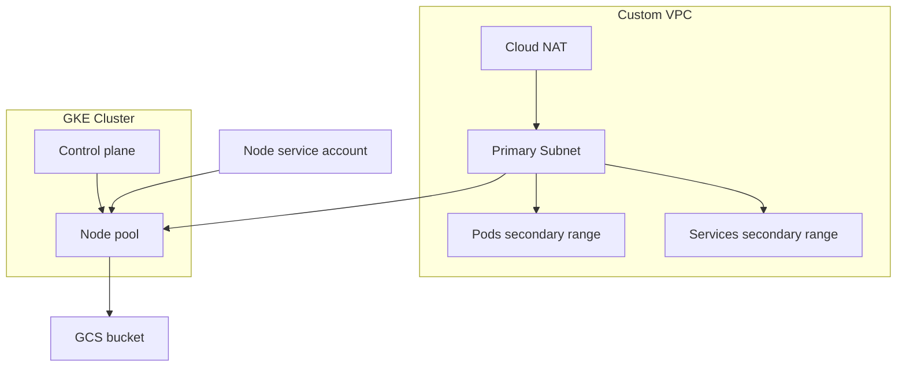

# Terraform + Kubernetes interview prep

## Why this exists

I put this together to help myself and others prep for Terraform and Kubernetes interviews by keeping a compact, runnable example that is easy to reason about and explain. It is intentionally small but realistic enough to spark discussion about design tradeoffs, reliability, and operability.

## Scope

This folder contains a runnable Terraform example focused on GCP VPC, IAM, GKE, and GCS. It is designed to be quick to explain in an interview while still showing real-world patterns like private GKE, NAT, and least-privilege IAM.

## If you found this while prepping

If you have discovered this and are prepping for your own interview go to <find good references>.

## Concept checklist

- Terraform basics: state, plan/apply, variables, outputs, and dependency graph.
- GCP networking: VPC, subnets, secondary ranges, firewall rules, NAT.
- IAM: service accounts, role bindings, least privilege.
- GKE: private cluster, node pools, autoscaling.
- Storage: GCS bucket, versioning, lifecycle.

## Talking points

- Private GKE clusters reduce control plane exposure but require NAT for egress.
- Secondary ranges enable VPC-native pod and service networking.
- Least-privilege IAM for node pools limits blast radius.
- Lifecycle rules balance cost vs retention for object storage.
- Outputs make handoffs and debugging easier.

## Typical interview flow (Coderbyte-style)

- You may be asked to use the interviewer's environment, which can be locked down or preconfigured.
- Sometimes you can use your own environment, and LLM access may or may not be allowed.
- If you do choose to use your own environment, set it up ahead of time (Terraform version, cloud auth, and any tools you rely on).
- Plan your explanation: narrate why each resource exists and what the failure modes are.
- Keep changes small and reversible while you talk through the solution.

## Notes for infra-focused roles

For infrastructure roles like the Apollo Infrastructure Engineering Manager posting, interviewers tend to probe reliability, observability, incident response, and cost tradeoffs in addition to raw implementation details. Keep a few concrete examples ready: how you would define SLOs, respond to production incidents, and manage cloud costs at scale. Reference: [Apollo Engineering Manager, Infrastructure](https://job-boards.greenhouse.io/apolloio/jobs/5670454004).

## Runbook

From this folder:

```bash
terraform init
terraform fmt
terraform validate
terraform plan -var="project_id=YOUR_PROJECT" -var="gcs_bucket_name=UNIQUE_BUCKET"
terraform apply -var="project_id=YOUR_PROJECT" -var="gcs_bucket_name=UNIQUE_BUCKET"
```

### Required inputs

- `project_id` and `gcs_bucket_name` are required.
- Optional: `environment`, `region`, `zones`, and CIDR inputs in `variables.tf`.

## Full setup (step-by-step)

These steps assume macOS. If you are on Linux/Windows, follow the equivalent Terraform + gcloud installation docs for your OS.

### 1) Create a GCP account and project

1. Create a Google Cloud account and start a free trial if available.
2. Create a new project in the GCP Console.
3. Note the project ID (you will pass this to Terraform as `project_id`).
4. Ensure billing is enabled for the project (required for GKE, NAT, and GCS).

### 2) Install Homebrew (if needed)

```bash
/bin/bash -c "$(curl -fsSL https://raw.githubusercontent.com/Homebrew/install/HEAD/install.sh)"
```

### 3) Install Terraform

```bash
brew tap hashicorp/tap
brew install hashicorp/tap/terraform
terraform version
```

### 4) Install the Google Cloud SDK (gcloud)

```bash
brew install --cask google-cloud-sdk
```

Then initialize the SDK:

```bash
gcloud init
```

### 5) Authenticate for Terraform

Terraform uses Application Default Credentials (ADC) for the Google provider. Run:

```bash
gcloud auth application-default login
```

### 6) Set your project

```bash
gcloud config set project YOUR_PROJECT
```

### 7) Enable required APIs

You can enable these in the GCP Console or via the CLI:

```bash
gcloud services enable \
  compute.googleapis.com \
  container.googleapis.com \
  iam.googleapis.com \
  storage.googleapis.com \
  logging.googleapis.com \
  monitoring.googleapis.com
```

### 8) Configure Terraform inputs

- Pick a globally unique bucket name for `gcs_bucket_name`.
- Optionally adjust CIDRs and region in `variables.tf`.

### 9) Initialize and validate

```bash
terraform init
terraform fmt
terraform validate
```

### 10) Plan and apply

```bash
terraform plan -var="project_id=YOUR_PROJECT" -var="gcs_bucket_name=UNIQUE_BUCKET"
terraform apply -var="project_id=YOUR_PROJECT" -var="gcs_bucket_name=UNIQUE_BUCKET"
```

### 11) Verify resources

```bash
gcloud container clusters list
gcloud compute networks list
gsutil ls
```

### 12) Clean up (avoid costs)

```bash
terraform destroy -var="project_id=YOUR_PROJECT" -var="gcs_bucket_name=UNIQUE_BUCKET"
```

## Deploy runbook

1. Authenticate to GCP: `gcloud auth application-default login`.
2. Set your project: `gcloud config set project YOUR_PROJECT`.
3. Enable APIs (if needed): Compute Engine, Kubernetes Engine, IAM, Cloud Storage.
4. Run the Terraform steps in the Runbook section.
5. Verify resources:
   - `gcloud container clusters list`
   - `gcloud compute networks list`
   - `gsutil ls`
6. Safe destroy: `terraform destroy -var="project_id=YOUR_PROJECT" -var="gcs_bucket_name=UNIQUE_BUCKET"`.

## Testing harness

From this folder:

```bash
./tests/validate.sh
```

This runs `terraform fmt -check` and `terraform validate` to keep the config tidy and consistent.

## System diagram


